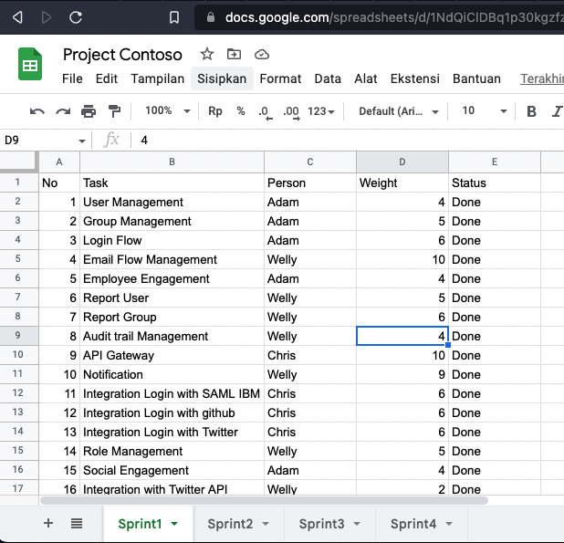
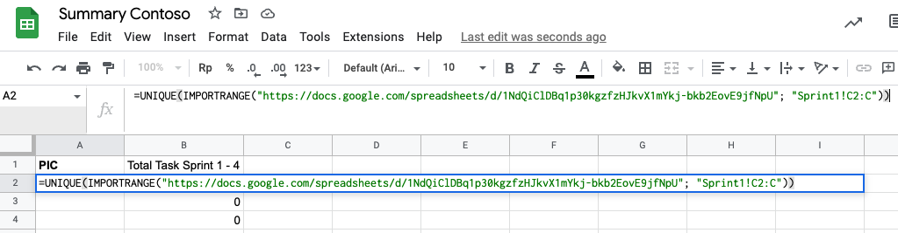
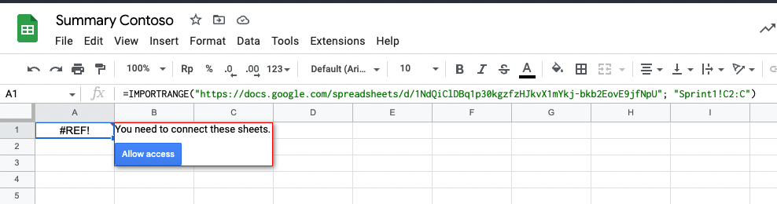
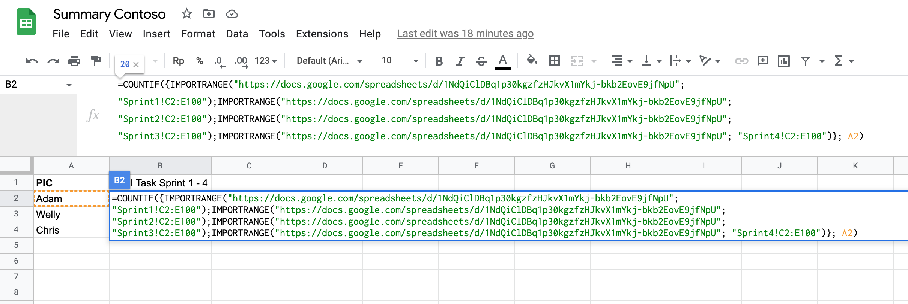
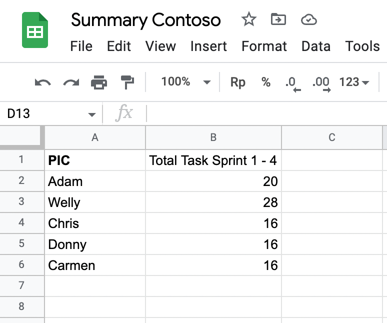

Sometimes we have a situation when numerous reports are scattered, and redundancy happens. For example, in a project management task (if using a traditional method, e.q: collecting assignments in a google sheet with additional weight recorded), a Project owner usually divided assignments within a sprint as a sheet.

*Sample spreadsheet*

As a project running within multiple sprints, we have many sheets separated. The next question is How do we measure all data within all sprints? The traditional way is to copy all assignments within many sheets to a new sheet and grab them as statistics. 

Google sheet is a powerful tool if you know how to utilize it. They have `IMPORTRANGE` function for linking between google sheet documents. So for case project management tasks, the data on assignments are divided into many sheets. 

With Google Sheets, it’s easy to combine data into one spreadsheet to create a single source of the document.

Step 1: Identify the spreadsheets you want to combine
In our case is project.xlsx with many sheets as a source. Copy the spreadsheet URL, need this as a parameter in the function.

Step 2: Define what kind of reports in new spreadsheets
Team performance in the project within four sprints can be the idea for a type of report we want to generate in new spreadsheets.

| Person of Incharge | Total Task on Sprint 1-4 |
|--------------------|--------------------------|
| Anne               | 11                       |
| Adam               | 24                       |
*Sample output report*

Edit cell value in column `A2` with formula `=UNIQUE(IMPORTRANGE("DOC_URL"; "Sprint1!C2:C"))`, and replace `DOC_URL` with your spreadsheet URL (e.q: `https://docs.google.com/spreadsheets/d/UniqueIDofSpreadSheet`)

After that will display the unique values of rows (Person of Incharge) in the previous spreadsheets

Edit cell value in column `B2` with formula `=COUNTIF({IMPORTRANGE("DOC_URL"; "Sprint1!C2:E100");IMPORTRANGE("DOC_URL"; "Sprint2!C2:E100");IMPORTRANGE("DOC_URL"; "Sprint3!C2:E100");IMPORTRANGE("DOC_URL"; "Sprint4!C2:E100")}; A2) `, and replace `DOC_URL` with your spreadsheet URL. This formula uses `{}` as an array to collect the range of Sprint 1 - 4 as data ranges.

Copy the formula to the bottom of the rows.

Now you have a summary report from another spreadsheet without copying. When the source spreadsheet is updated, the summary will follow. 

Happy Hacking Google Sheet :)