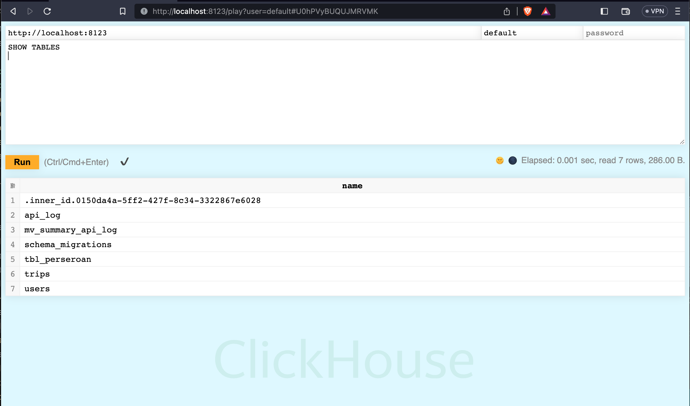
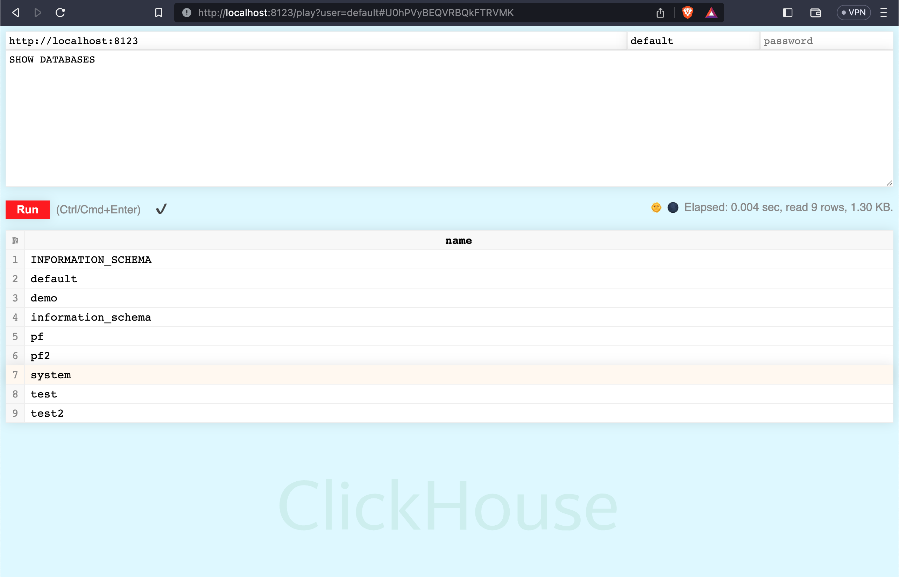
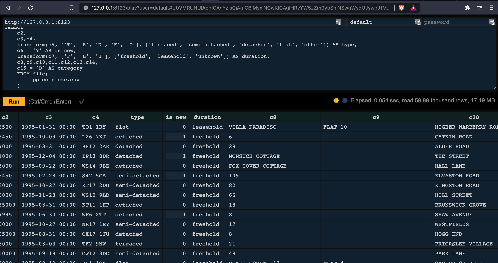

ClickHouse is a fast open-source OLAP database management system. It is column-oriented and allows generating reports (analytical) using SQL queries in real-time.

Before we discuss more ClickHouse, why must columnar Database? You check more the reason in [this article](https://codedaily.in/when-to-use-columnar-databases).

## Download the Dataset​
Run the command:  
```text
wget -c \
http://prod.publicdata.landregistry.gov.uk.s3-website-eu-west-1.amazonaws.com/pp-complete.csv
```
*Download will take about 2 minutes with good internet connection.*

## Running Scenario with MySQL
Before importing and playing with ClickHouse, i want to show alternative way using MySQL, it's different but worthed.

### Create the Table​
```sql
CREATE TABLE `uk_price_paid` (
  `price` int DEFAULT '0',
  `date` date DEFAULT NULL,
  `postcode` varchar(100) DEFAULT NULL,
  `type` varchar(10) DEFAULT NULL,
  `is_new` varchar(10) DEFAULT NULL,
  `duration` varchar(10) DEFAULT NULL,
  `addr1` varchar(255) DEFAULT NULL,
  `addr2` varchar(255) DEFAULT NULL,
  `street` varchar(255) DEFAULT NULL,
  `locality` varchar(255) DEFAULT NULL,
  `town` varchar(255) DEFAULT NULL,
  `district` varchar(255) DEFAULT NULL,
  `county` varchar(255) DEFAULT NULL,
  `category` varchar(10) DEFAULT NULL,
  `id` int NOT NULL AUTO_INCREMENT,
  PRIMARY KEY (`id`)
) ENGINE=InnoDB DEFAULT CHARSET=utf8mb4 COLLATE=utf8mb4_0900_ai_ci;
```

### Import the Data
Configure MySQL cnf file with additional configs
```
secure-file-priv = "$HOME/user_files"
```
Replace `$HOME` with your home path, create user_files directory when not exist.

This is for prevent error query for load file
`ERROR 1064 (42000): You have an error in your SQL syntax; check the manual that corresponds to your MySQL server version for the right syntax to use near '--secure-file-priv' at line 1`

Run this query:
```sql
LOAD DATA LOCAL INFILE 'pp-complete.csv'  
 INTO TABLE demo.uk_price_paid FIELDS TERMINATED BY ',' ENCLOSED BY '"' 
 LINES TERMINATED BY '\n' 
 (@dummy,price,date,postcode,type,is_new,duration,addr1,addr2,street,locality,town,district,county,category,@dummy);
```
*@dummy vars used for ignoring column from unneeded csv*

Check the data:
```sql
mysql> SELECT count(*) FROM uk_price_paid;
+----------+
| count(*) |
+----------+
| 27359803 |
+----------+
1 row in set (11.43 sec)
```
Yes, using common RDBMS for storing large data set and counting directly to it is not really recommended, if you still decide using RDMS please use another table for counting only


## Trying ClickHouse

After [installing](https://clickhouse.com/docs/en/quick-start) it on my desktop, start connecting to the database.

You can connect to ClickHouse using the built-in UI or the ClickHouse client.

### Use the Built-in UI​
The ClickHouse server listens for HTTP clients on port 8123 by default. There is a built-in UI for running SQL queries at `http://127.0.0.1:8123/play` (change the hostname accordingly).  


Notice in your Play UI that the username was populated with default and the password text field was left empty. If you assigned a password to the default user, enter it into the password field.

Try running a query. For example, the following returns the names of the predefined databases: 
```sql
SHOW DATABASES
```
Click the RUN button and the response is displayed in the lower portion of the Play UI:


### Create the Database
Use the `CREATE DATABASE` command to create a new database in ClickHouse
```sql
CREATE DATABASE IF NOT EXISTS demo
```

### Create the Table​
```sql
CREATE TABLE demo.uk_price_paid
(
    price UInt32,
    date Date,
    postcode LowCardinality(String),
    type Enum8('terraced' = 1, 'semi-detached' = 2, 'detached' = 3, 'flat' = 4, 'other' = 0),
    is_new UInt8,
    duration Enum8('freehold' = 1, 'leasehold' = 2, 'unknown' = 0),
    addr1 String,
    addr2 String,
    street LowCardinality(String),
    locality LowCardinality(String),
    town LowCardinality(String),
    district LowCardinality(String),
    county LowCardinality(String),
    category UInt8
) ENGINE = MergeTree ORDER BY (postcode, addr1, addr2);
```

### Preprocess and Import Data​
We will use Play UI tool for data preprocessing.
In this example, we define the structure of source data from the CSV file and specify a query to preprocess the data with Play UI.

The preprocessing is:
- splitting the postcode to two different columns postcode1 and postcode2 that is better for storage and queries;
- coverting the time field to date as it only contains 00:00 time;
- ignoring the UUid field because we don't need it for analysis;
- transforming type and duration to more readable Enum fields with function transform;
- transforming is_new and category fields from single-character string (Y/N and A/B) to UInt8 field with 0 and 1.

Copy csv file to `$HOME/user_files` folders, run this sql to Play UI

```sql
SELECT 
    c2,
    toDate(toDateTime(CONCAT(c3,':00'))),,c4,
    transform(c5, ['T', 'S', 'D', 'F', 'O'], ['terraced', 'semi-detached', 'detached', 'flat', 'other']) AS type,
    c6 = 'Y' AS is_new,
    transform(c7, ['F', 'L', 'U'], ['freehold', 'leasehold', 'unknown']) AS duration,
    c8,c9,c10,c11,c12,c13,c14,
    c15 = 'B' AS category
    FROM file(
        'pp-complete.csv'
    )
```



Wow, we can also see huge of csv file content direct via ClickHouse.

Run this sql to Play UI
```sql
INSERT INTO demo.uk_price_paid
SELECT 
    c2,
    toDate(toDateTime(CONCAT(c3,':00'))),
    c4,
    transform(c5, ['T', 'S', 'D', 'F', 'O'], ['terraced', 'semi-detached', 'detached', 'flat', 'other']) AS type,
    c6 = 'Y' AS is_new,
    transform(c7, ['F', 'L', 'U'], ['freehold', 'leasehold', 'unknown']) AS duration,
    c8,c9,c10,c11,c12,c13,c14,
    c15 = 'B' AS category
    FROM file(
        'pp-complete.csv'
    )
```
It will take about 40 seconds.

### Validate the Data​
Query:
```sql
SELECT count() FROM demo.uk_price_paid;
```

Result:
```
┌──count()─┐
│ 27359802 │
└──────────┘
1 row in set. Elapsed: 0.009 sec.
```
The size of dataset in ClickHouse is just 317 MiB, check it.

Query:
```sql
SELECT formatReadableSize(total_bytes) FROM system.tables WHERE name = 'uk_price_paid';
```

Result:
```
┌─formatReadableSize(total_bytes)─┐
│ 317.41 MiB                      │
└─────────────────────────────────┘
1 row in set. Elapsed: 0.003 sec.
```

### Run Some Queries​
#### Query Average Price Per Year​
Query:
```sql
SELECT toYear(date) AS year, round(avg(price)) AS price, bar(price, 0, 1000000, 80) FROM demo.uk_price_paid GROUP BY year ORDER BY year;
```

Result:
```sql
┌─year─┬──price─┬─bar(round(avg(price)), 0, 1000000, 80)─┐
│ 1995 │  67933 │ █████▍                                 │
│ 1996 │  71508 │ █████▋                                 │
│ 1997 │  78536 │ ██████▎                                │
│ 1998 │  85440 │ ██████▋                                │
│ 1999 │  96038 │ ███████▋                               │
│ 2000 │ 107487 │ ████████▌                              │
│ 2001 │ 118888 │ █████████▌                             │
│ 2002 │ 137947 │ ███████████                            │
│ 2003 │ 155893 │ ████████████▍                          │
│ 2004 │ 178888 │ ██████████████▎                        │
│ 2005 │ 189359 │ ███████████████▏                       │
│ 2006 │ 203532 │ ████████████████▎                      │
│ 2007 │ 219375 │ █████████████████▌                     │
│ 2008 │ 217055 │ █████████████████▎                     │
│ 2009 │ 213419 │ █████████████████                      │
│ 2010 │ 236107 │ ██████████████████▊                    │
│ 2011 │ 232802 │ ██████████████████▌                    │
│ 2012 │ 238381 │ ███████████████████                    │
│ 2013 │ 256928 │ ████████████████████▌                  │
│ 2014 │ 279982 │ ██████████████████████▍                │
│ 2015 │ 297264 │ ███████████████████████▋               │
│ 2016 │ 313494 │ █████████████████████████              │
│ 2017 │ 346348 │ ███████████████████████████▋           │
│ 2018 │ 350547 │ ████████████████████████████           │
│ 2019 │ 352105 │ ████████████████████████████▏          │
│ 2020 │ 375843 │ ██████████████████████████████         │
│ 2021 │ 380525 │ ██████████████████████████████▍        │
│ 2022 │ 354501 │ ████████████████████████████▎          │
└──────┴────────┴────────────────────────────────────────┘

28 rows in set. Elapsed: 0.111 sec. Processed 27.36 million rows, 164.16 MB (245.43 million rows/s., 1.47 GB/s.)
```

### Summary
Pro:
- You can use for analyzing large dataset csv or text without creating table
- Efficient storage and (soft) real-time query over the analytics data
- Incredibly fast
- Can integrate with another [Database](https://clickhouse.com/docs/en/integrations/)
- Designed for analytical purpose
- Realtime
- Open Source
- SQL

Cons:
- Just insert data, no update or deleted records

### References
- https://codedaily.in/when-to-use-columnar-databases
- https://blog.duyet.net/2021/08/good-reasons-to-use-clickhouse.html
- https://en.wikipedia.org/wiki/Column-oriented_DBMS
- https://clickhouse.com/docs/en/getting-started/example-datasets/uk-price-paid