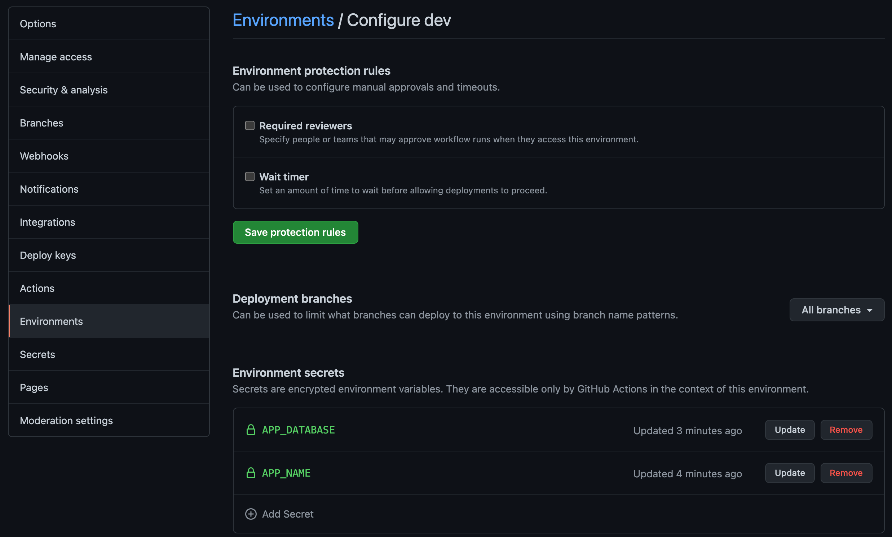
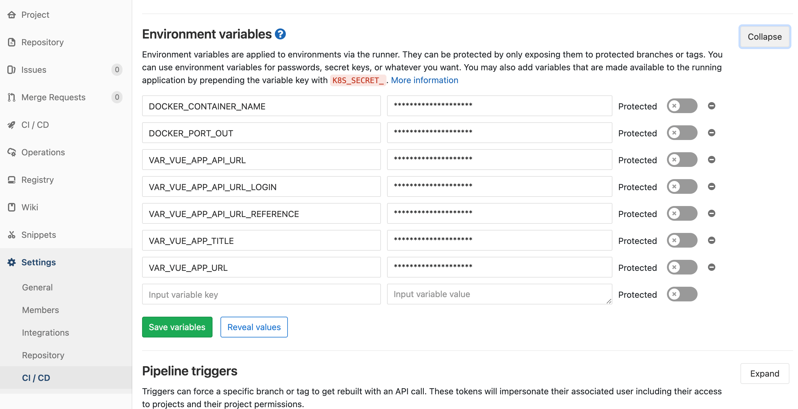

Yes, in the past before continues integration era managing configuration apps in multiple environments is pain in the ass. 
In modern development, environment file (usually .env file) ignored in repository, how we manage it without committing the credentials in the code?
Reposity environment came with rescue, in [github](https://docs.github.com/en/actions/reference/environment-variables#about-environment-variables) and [gitlab](https://docs.gitlab.com/ce/ci/environments/) there's environtment tab in your project repository.


*Github Environtment look like*


*Gitlab Environtment look like*

Okay, already create the environment configuration in repository (github / gitlab), is it secure? what's next?
The credential or secret vars will shown by maintainers only, don't worry github / gitlab secured it for us. So what's next? 

In shell we can use these method for accessing environment variable
```sh
echo $MY_SECRET_VAR
docker-compose --env-file <(env | grep ^VAR_PREFIX) up;
```

Yes, `<(env | grep ^VAR_PREFIX)` will create an temporary files from repository env, but this things works on bash shell only, and got another limitation, when the value env var is multiline (like SSH public or secret key), errors will be occurs.

Another stable approach is using [`compgen`](https://www.gnu.org/software/bash/manual/html_node/Programmable-Completion-Builtins.html)

```sh
<(compgen -v | InsertYourGrepFilter | while read line; do echo $line=${!line};done)
```

Pass to docker-compose:
```sh
docker-compose --env-file \
  <(compgen -v | InsertYourGrepFilter \
  | while read line; do echo $line=${!line};done)
```
Within this approach, all secret variable wether multiline or have weird character will pass safety